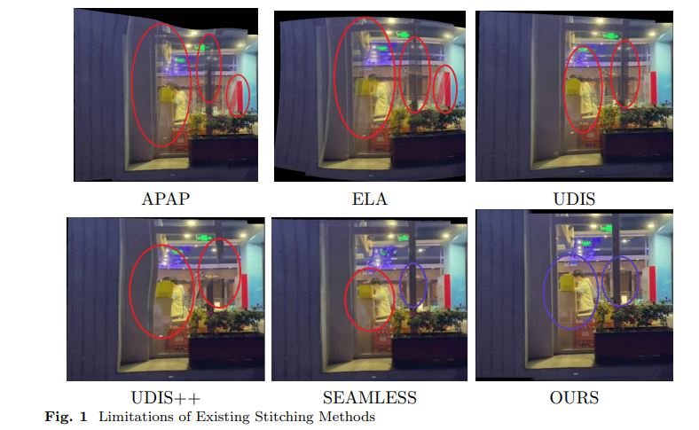

<h1 align="center">SEAMLESSLY NATURAL</h1>

  

  <em>An image stitching algorithm for high-quality panoramic reconstruction</em>

<h2>🔍 Description</h2>

  This repository presents <strong>SEAMLESSLY NATURAL</strong>, an image stitching algorithm designed to produce 
  <strong>high-quality panoramic images</strong>. The method preserves both <strong>global consistency</strong> 
  and <strong>local structures</strong>, while ensuring a <strong>visually natural appearance</strong>.

<h2>🧪 Dataset: UDIS-D</h2>

  Experiments were conducted using the <strong>UDIS-D</strong> dataset. Since the proposed algorithm relies on 
  the input image order, the dataset was reorganized into <strong>ordered sequences</strong>. The resulting version 
  used in our experiments is referred to as <strong>UDIS_datasetuni</strong>.

<h2>📊 Evaluation: BRISQUE (BRI) Scores</h2>

  Image quality is evaluated using <strong>BRISQUE</strong>, a no-reference perceptual quality metric 
  that assesses the naturalness of the generated images.

<h3>📂 Evaluation Procedure</h3>

This metric is computed on the final stitched images produced by the method.

<ol>
  <li>
    Use the reorganized dataset <code>UDIS_datasetuni</code>, where images are arranged in the correct order.
  </li>
  <li>
    To compute the BRISQUE (BRI) scores, run the evaluation script 
    <code>brisque_evaluation.py</code>.
  </li>
  <li>
    Example results are available in the folder 
    <code>"our results on UDIS dataset"</code>. However, the script can be used to evaluate 
    any set of stitched images.
  </li>
</ol>

  You can download the test dataset and example results obtained on different datasets here: 
  👉 https://drive.google.com/drive/folders/1CUV0PjbWwC7lh_VVOazLt5XnPYELgjfc?usp=drive_link

<h2>⚙️ Requirements</h2>

The project requires the following dependencies:

<pre><code>
torch>=2.0.0
torchvision>=0.15.0
numpy>=1.24.0
scipy>=1.10.0
opencv-python>=4.8.0
opencv-contrib-python>=4.8.0
Pillow>=10.0.0
imageio>=2.31.0
scikit-image>=0.21.0
matplotlib>=3.7.0
</code></pre>

<h2>🚀 Usage</h2>

Two execution options are provided:

<ul>
  <li>
    <strong>Jupyter Notebook (.ipynb):</strong>  
    Can be executed using <strong>Google Colab</strong> or any local Jupyter environment.  
    This option is recommended for quick testing and visualization.
  </li>

  <li>
    <strong>Python Script (.py):</strong>  
    Can be executed locally in a standard Python environment for full control and integration into pipelines.
  </li>
</ul>

  Choose the option that best fits your workflow and computational setup.

